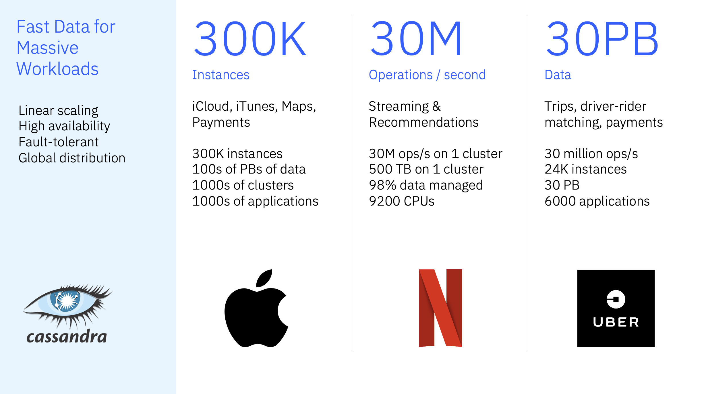

# Cassandra fundamentals — training and labs

## About Apache Cassandra

[Apache Cassandra](https://cassandra.apache.org/) is an open source, **distributed wide-column** database designed for **massive scale**, **high availability**, and **predictable low latency** on commodity hardware or in the cloud. It uses a **masterless**, peer-to-peer topology: every node can serve reads and writes, and data is replicated across the cluster with **tunable consistency** so applications can trade latency against how many replicas must agree on each operation.

People use Cassandra as an **operational data store** for live workloads—time series and metrics, event logging, product catalogs, session and profile data, messaging back ends, IoT ingestion, and increasingly **AI/ML** and retrieval-style pipelines where throughput and uptime matter more than ad-hoc relational joins. The project describes it as trusted by **thousands of companies** with large active data sets; release testing includes clusters of up to **1,000 nodes**. A public case study on the Cassandra site quotes **Bloomberg** serving **more than 20 billion requests per day** on a **~1 PB** dataset across **1,700+** nodes. The **2024 Apache Cassandra user survey** published **140** responses on use cases, deployment size, and experience. See [References](#references) for links.



This repository is **hands-on training**: you explore architecture concepts using a **three-node** local cluster via Docker Compose. Training modules are numbered **01–07** in order. Each module opens with a short **Terms** line where needed so abbreviations (e.g. **CQL**, **RF**, **CL**, **CAP**, **LSM**) are defined once.

## Learning path

| Module | File |
|--------|------|
| 01 — Fundamentals and deployment | [training/01-fundamentals-and-deployment.md](training/01-fundamentals-and-deployment.md) |
| 02 — Lab environment | [training/02-lab-environment.md](training/02-lab-environment.md) |
| 03 — Masterless, peers, placement | [training/03-masterless-peers-and-placement.md](training/03-masterless-peers-and-placement.md) |
| 04 — CAP and tunable consistency | [training/04-cap-and-tunable-consistency.md](training/04-cap-and-tunable-consistency.md) |
| 05 — Gossip and topology | [training/05-gossip-and-topology.md](training/05-gossip-and-topology.md) |
| 06 — Storage engine (write/read, compaction, tombstones) | [training/06-storage-engine-write-through-read.md](training/06-storage-engine-write-through-read.md) |
| 07 — Self-healing, LWT, summary | [training/07-self-healing-lwt-and-summary.md](training/07-self-healing-lwt-and-summary.md) |

**Modules 01–04** cover when to use Cassandra, the lab cluster, placement on the ring, and consistency. **Modules 05–07** go deeper into gossip, the storage engine, and self-healing / LWT.

## Prerequisites

- Docker Desktop or Docker Engine **with Compose v2**
- About **4 GB** free RAM for the stack (heap capped at 512 MB per node in `docker-compose.yml`)

## Start the lab cluster

```bash
docker compose up -d
```

If your installation only provides Compose v1:

```bash
docker-compose up -d
```

Wait until all nodes show **UN** (up/normal):

```bash
docker exec cassandra-1 nodetool status
```

Connect with **cqlsh** (from any node):

```bash
docker exec -it cassandra-1 cqlsh cassandra-1 9042
```

The host maps **port 9042** to `cassandra-1` for drivers connecting from your machine (e.g. `127.0.0.1:9042`).

## Stop and reset

```bash
docker compose down
```

To wipe data volumes and start clean:

```bash
docker compose down -v
```

## References

1. Apache Software Foundation, *Apache Cassandra* (homepage: scale, testing, and user quotes). [https://cassandra.apache.org/](https://cassandra.apache.org/)
2. Apache Cassandra community, *2024 User Survey Results* (October 2024, n=140). [https://cassandra.apache.org/_/blog/2024-User-Survey.html](https://cassandra.apache.org/_/blog/2024-User-Survey.html)

Thanks to **David Leconte** for the architecture diagrams and images used in the training modules.
