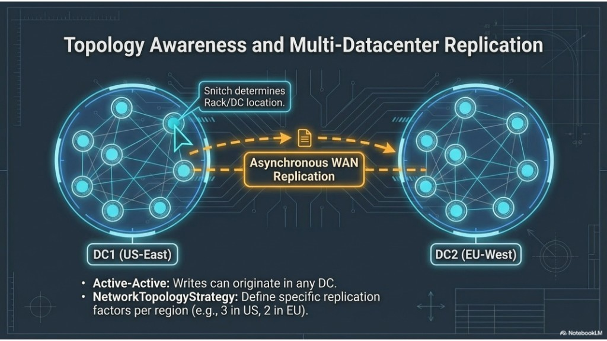

# Apache Cassandra: Architecture & Operations — Training Guide

**Hands-on labs** use the Docker Compose cluster and live in split modules under **[training/](training/)** — start with [training/01-lab-environment.md](training/01-lab-environment.md). Project overview: [README.md](README.md).

---

This single file walks through core Cassandra concepts in one place. Each section pairs **explanation** with the matching **infographic** in `assets/` (same material as your slide deck).

---

## 1. Masterless architecture

**What it means:** In a Cassandra cluster, **no node is special**. There is no primary, coordinator-of-all-writes, or metadata master that the whole system depends on. Every node can accept reads and writes for the data it owns (and coordinate requests). The cluster is designed for **high availability** and **no single point of failure** from topology alone.

**How it shows up:** Nodes form a **peer-to-peer ring**. They communicate over the network (replication, gossip). Internally you still see **commit logs**, **memtables**, and **SSTables** on each node—but **role-wise**, nodes are peers.

**Why it matters:** If one node fails, others continue serving traffic. You scale by **adding nodes**, not by buying one bigger “master” machine.

**Takeaways:** No master; every node can serve; replication + gossip keep the cluster coherent; tunable consistency applies per operation.

---

## 2. Peers, not masters

**What it means:** Contrast with **master/slave** designs: a single writer (master) becomes a **write bottleneck** and a **single point of failure**. In Cassandra, **every node is a peer**: writes and reads are not funneled through one machine.

**Benefits (as in the diagrams):**

- **No single point of failure** — the cluster survives loss of individual nodes.
- **Linear scalability** — roughly, more nodes → more aggregate throughput (workload-dependent, but the model is scale-out).
- **Commodity hardware** — scale **out** with many standard servers instead of scaling **up** one huge box.

**Takeaways:** Avoid thinking in “primary replica only for all writes”; think **token ranges**, **replication factor**, and **consistency level** instead.

---

## 3. Data placing

**What it means:** Cassandra decides **which nodes store a given partition** using a **partition key** (and optional clustering columns). Placement is driven by:

- **Hashing the partition key** into a value in the **token ring**.
- **Virtual nodes (vNodes)** — each physical machine owns **many small ranges** on the ring, not one big slice. That makes **rebalancing** and **recovery** smoother when nodes join or leave.

**Consistent hashing** maps keys to positions on the ring; **replication** then places additional copies according to your **replication strategy** (e.g. `SimpleStrategy` in a single DC, `NetworkTopologyStrategy` across racks/DCs).

**Takeaways:** Partition key design controls distribution; vNodes decouple physical nodes from token ranges; multi-DC placement uses **NetworkTopologyStrategy** and **snitches**.

---

## 4. CAP theorem

**CAP** (at a high level): when the network **partitions**, you cannot have both **strong linearizable consistency** everywhere and **100% availability** for all operations—something has to give.

**Cassandra’s usual framing:** It is typically described as an **AP-leaning** system in the CAP sense: it prioritizes **availability** and **partition tolerance**, and relies on **replication**, **repair**, and **tunable consistency** so that replicas **eventually** agree.

**Eventual consistency:** Divergent replicas are reconciled **asynchronously** (reads/writes, repair, compaction). Under partitions, Cassandra can still **accept writes** on available sides of the split; applications must choose consistency levels that match their risk tolerance.

**Takeaways:** Network failures are assumed; “AP default” does not mean “no consistency”—it means **you choose** how strong each operation is.

---

## 5. Tunable consistency

**What it means:** For each read or write, you set a **consistency level (CL)** that defines **how many replicas** must respond before the operation succeeds. Examples:

| Level (conceptual) | Behavior (simplified) |
|--------------------|------------------------|
| **ONE** | Fast; wait for one replica acknowledgment. |
| **QUORUM** | Majority of replicas in the replication set (e.g. RF=3 → 2). |
| **ALL** | All replicas; strongest alignment, highest latency and fragility if any node is down. |

**Strong read-your-writes style guarantee (intuition):** A common rule of thumb is **R + W > RF** (read level + write level exceeding replication factor) so the read and write quorums **overlap** at least one replica—illustrated on your consistency “dial” slide.

**Takeaways:** CL is a **latency vs correctness** knob; global defaults and per-statement overrides should match application semantics.

---

## 6. Gossip

**What it means:** **Gossip** is the **epidemic** protocol nodes use to share **cluster membership**, **health**, **load**, and **schema/token map** metadata. Each round, a node talks to a **few** peers; information spreads in **O(log N)**-style fashion across large clusters.

**Failure detection:** Cassandra uses **accrual** (e.g. phi-accrual style) failure detection—**probabilistic**, not a single missed ping = dead—so **transient network jitter** is less likely to cause false failures.

**Takeaways:** Gossip is for **control plane** metadata, not your application row data path; it enables routing, repairs, and awareness of who is up.

---

## 7. Topology aware

**What it means:** Real clusters live in **racks** and **data centers**. A **snitch** tells Cassandra how nodes map to **rack** and **DC** so the ring and replication can be **topology-aware**: e.g. avoid putting all replicas on one rack, or place copies in multiple regions.

**Multi-DC:** Replication across WAN is often **asynchronous**; **active-active** setups allow writes in different DCs. **`NetworkTopologyStrategy`** defines **per-DC replication factors** (e.g. 3 in US-East, 2 in EU-West).

**Takeaways:** Pick snitch + strategy to match physical layout; clients often use **local CL** in multi-DC for predictable latency.

---

## 8. Write path

**What it means:** Writes are optimized for **sequential I/O** using an **LSM-tree** style pipeline on each node:

1. **Commit log (disk)** — append-only, **durability** first; survives crashes.
2. **Memtable (RAM)** — sorted in-memory buffer for **speed**; later flushed.

The write hits **both**: log for safety, memtable for fast serving and flush preparation.

**Takeaways:** Writes are fast appends; random in-place updates to old files are not the model.

---

## 9. Memory to disk

**What it means:** When a memtable fills (or other flush triggers), Cassandra **flushes** it to immutable **SSTables** on disk.

**SSTable properties (conceptual):**

- **Immutable** — once written, not updated in place; changes mean **new** data/tombstones in **new** SSTables.
- **Sorted by partition key** — efficient scans within a partition.
- **Partition index** — helps jump to the right place in the file.

**Takeaways:** “Update” at storage level is often **append new version**; merging happens at read time and via **compaction**.

---

## 10. Read path

**What it means:** A read merges **the latest** view from:

1. **Memtable** — newest in-memory data.
2. **SSTables** — with shortcuts:
   - **Bloom filter** — cheap “maybe present” check to skip disk.
   - **Key cache** — offset hints for index lookups.
3. **Merge** — reconcile versions with **last-write-wins** (using timestamps), subject to consistency level and tombstones.

**Takeaways:** Hot data in memory; cold data filtered before full seeks; multiple sources merged for one logical row.

---

## 11. Compaction

**What it means:** Background **compaction** merges SSTables to reduce **read amplification** (too many files to check per read). Strategy chooses **which** SSTables merge and **when**.

Common strategies (names vary slightly by version):

- **Size-tiered (STCS)** — tends to favor **write-heavy** workloads.
- **Leveled (LCS)** — favors **read-heavy** patterns with more predictable read cost.
- **Unified (UCS)** — **adaptive** (newer releases; e.g. highlighted as new in 5.x-era material).

**Takeaways:** Compaction trades **disk I/O** and **write amplification** for fewer, more efficient reads; wrong strategy for your workload hurts latency or space.

---

## 12. Tombstones

**What it means:** Because SSTables are **immutable**, a **delete** is a **write** of a **tombstone** marker. Reads must **shadow** older values with the tombstone so deleted data does not reappear.

**GC grace:** Tombstones are kept for a **grace period** (default often on the order of **days**) so replicas that were down can still receive the delete via repair before **physical** removal—otherwise you risk **revived** ghosts.

**Takeaways:** Deletes are not free; heavy delete patterns need **modeling** and **compaction/repair** hygiene; wide partitions + churn can create tombstone pain.

---

## 13. Self-healing: hints and repairs

**Hinted handoff:** If a replica is **temporarily down**, the coordinator may store a **hint** and deliver it when the node returns—covering short outages.

**Read repair:** During a read, if replicas disagree, the coordinator can **write back** the newer value to stale replicas (policy-dependent).

**Anti-entropy repair:** **Merkle-tree**-based comparisons (`nodetool repair`, incremental repair in modern versions) find and fix divergence **without** relying on a read path.

**Takeaways:** Hints handle brief failures; read repair fixes drift on read; scheduled repair handles large or cold data.

---

## 14. LWT (Lightweight Transactions)

**What it means:** For operations that need **linearizable** guarantees (e.g. **compare-and-set**, `IF NOT EXISTS`), Cassandra uses **Paxos-style** **lightweight transactions**. A typical flow involves multiple phases: **prepare/promise**, **propose/accept**, **commit/ack**—more **round-trips** than a normal write.

**Cost:** Often cited as on the order of **~4× round-trips** vs a standard write—use **only** where you need conditional logic, not for every row update.

**Takeaways:** LWT is **stronger** but **slower**; partition contention makes hot keys worse; prefer idempotent design and data model when you can.

---

## 15. Summary

**Architect’s summary (ties the deck together):**

| Theme | One-liner |
|-------|-----------|
| **Write** | Append-only **LSM**; high throughput. |
| **Read** | **Merged** view; Bloom filters, caches, SSTable seeks. |
| **Scale** | **Linear**, **vNode**-based, **masterless**. |
| **Consistency** | **Tunable**; **AP**-leaning default with **eventual** convergence. |
| **Ideal fit** | **High velocity**, **geo-distributed**, **uptime**-sensitive workloads—when the data model and consistency choices match the product needs. |

---

## Suggested study order

1. Masterless → Peers → Data placing (cluster shape).  
2. CAP → Tunable consistency (safety vs latency).  
3. Gossip → Topology (how the cluster knows the world).  
4. Write path → Memory to disk → Read path → Compaction → Tombstones (storage engine story).  
5. Self-healing → LWT (operations and special cases).  
6. Summary (integrate for interviews and design reviews).

---

*Training generated for the Cassandra fundamentals module; infographics referenced from `assets/`.*
