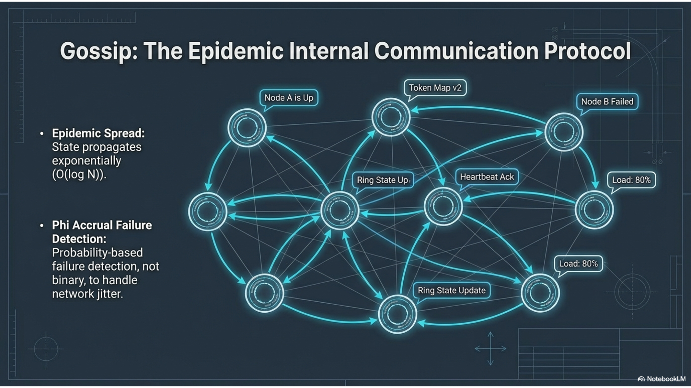

# 05 — Gossip and topology awareness

Topics: **gossip protocol**, **snitches**, **multi-DC ideas** (this lab stays **single DC**).

**Terms:**

| Term | Meaning |
|------|---------|
| **WAN** | Wide-area network (links between regions). |
| **Snitch** | Plugin that tells Cassandra each node’s **rack** and **DC** so replicas can be placed across failure domains. |
| **NTS** | `NetworkTopologyStrategy` (replication **per DC**). |

**Previous:** [04-cap-and-tunable-consistency.md](04-cap-and-tunable-consistency.md). **Next:** [06-storage-engine-write-through-read.md](06-storage-engine-write-through-read.md).

---

## 6. Gossip

**What it means:** **Gossip** is the epidemic protocol nodes use to share **membership**, **health**, **load**, and **schema/token map** metadata. Each round, a node exchanges state with a **few** peers; updates spread quickly across large clusters.

**Failure detection:** You need to know if a peer is dead to avoid sending it traffic. A naive heartbeat (“no reply in *X* seconds → dead”) suffers **false positives** when **network jitter** delays packets. **Accrual** (e.g. **phi-accrual**) failure detection uses a **suspicion score** instead of a hard cutoff, so brief lag is less likely to mark a healthy node as down.

**Accrual** failure detection is **probabilistic**, reducing false “dead” decisions under **network jitter**.



**Takeaways:** Gossip is **control-plane** metadata, not the application data path; it supports routing and repair decisions.

---

## 7. Topology aware

**What it means:** Production clusters span **racks** and **data centers**. A **snitch** maps nodes to **rack/DC** so replication can avoid placing all copies on one failure domain.

**Multi-DC:** Replication across a **WAN** is often **asynchronous**; **NetworkTopologyStrategy** sets **per-DC** replica counts. Clients often use **`LOCAL_*`** CLs (e.g. `LOCAL_QUORUM` = quorum **only** among replicas in the **coordinator’s DC**) to avoid cross-region latency on every request.

This Compose lab uses **one DC** and `SimpleStrategy` for simplicity; production multi-DC would switch strategy + snitch.


**Takeaways:** Match **snitch + replication strategy** to real layout; this module’s labs only **peek** at endpoint metadata.

---

## Lab A — Describe cluster and gossip peers

On the **host**:

```bash
docker exec cassandra-1 nodetool describecluster
docker exec cassandra-1 nodetool gossipinfo | head -40
```

**Deliverable:** From `describecluster`, note **name** and **partitioner**; from `gossipinfo`, confirm you see entries for peer IPs/hostnames.

---

## Lab B — Failure detector (read-only)

```bash
docker exec cassandra-1 nodetool failuredetector
```

**Deliverable:** One sentence linking **phi** / thresholds to **transient network** behavior (from the theory section).

---

## Lab C — Snitch and endpoint types (conceptual)

```bash
docker exec cassandra-1 nodetool describecluster
docker exec cassandra-1 cat /etc/cassandra/cassandra.yaml | grep -E '^endpoint_snitch|^# endpoint'
```

**Deliverable:** Which snitch is configured? Why is **SimpleSnitch** enough for this single-site lab but not for multi-DC production?

---

## Next

[06-storage-engine-write-through-read.md](06-storage-engine-write-through-read.md)
