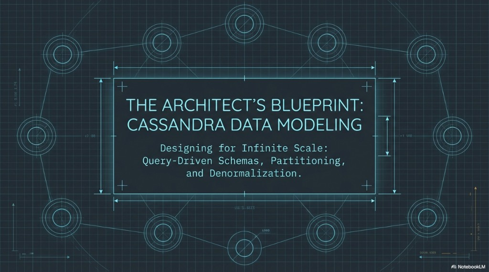
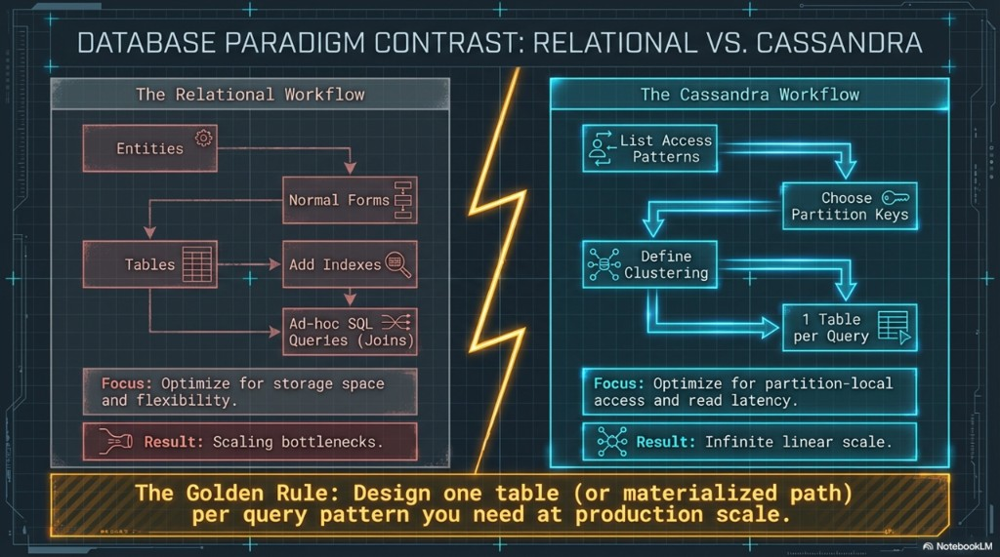

# DM 01 — The architect’s blueprint: relational vs Cassandra

Topics: **why query-first design**, **relational workflow vs Cassandra workflow**, **the golden rule**.

**Terms:**

| Term | Meaning |
|------|---------|
| **Partition key** | First part of the `PRIMARY KEY`; decides how rows are grouped into **partitions** and hashed onto the ring. |
| **Clustering key(s)** | Columns after the partition key; define **sort order** and row uniqueness **inside** one partition. |
| **Denormalization** | Storing the same logical information in more than one table so each **access pattern** can read without server-side joins. |

**Prerequisites:** Completing the **architecture** track through [07-self-healing-lwt-and-summary.md](../architecture/07-self-healing-lwt-and-summary.md) is recommended. The labs assume keyspace `lab_ks` from [02-lab-environment.md](../architecture/02-lab-environment.md).

**Previous:** [07-self-healing-lwt-and-summary.md](../architecture/07-self-healing-lwt-and-summary.md). **Next:** [02-process-and-primary-key.md](02-process-and-primary-key.md).

---

## Blueprint: designing for scale

Cassandra’s **masterless**, **log-structured** architecture can deliver **high throughput** and **linear scale-out**—but only if the **data model** matches how the cluster physically stores and retrieves data (partitions on the ring, LSM writes, tunable consistency). This track is the **architect’s blueprint**: query-driven schemas, partitioning, and deliberate duplication.

---

## Database paradigm contrast: relational vs Cassandra

**Typical relational workflow:** identify **entities** → apply **normal forms** to reduce redundancy → create **tables** → add **indexes** → run **ad hoc SQL** with **JOINs**. The usual focus is **storage efficiency** and flexible querying; at very large scale, complex joins and central bottlenecks can become **scaling constraints**.

**Cassandra workflow:** **list access patterns** first → **choose partition keys** so each query hits a known partition (or a small bounded set) → **define clustering** for order inside the partition → often **one table per query pattern** at production scale. The focus is **partition-local access** and **read latency**; duplication is acceptable when it buys predictable performance.

**Golden rule:** Design **one table** (or materialized path) **per query pattern** you need at **production scale**. If a pattern cannot be expressed as **known partition key + optional range on clustering**, you are still thinking in rows-and-joins—you likely need another table, a different key, or a different store.

---

## Next

[02-process-and-primary-key.md](02-process-and-primary-key.md) — the modeling process and primary key structure.
