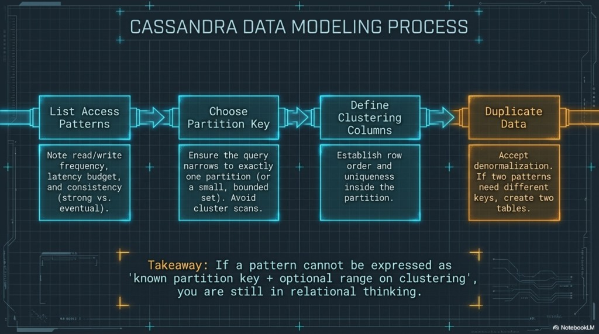
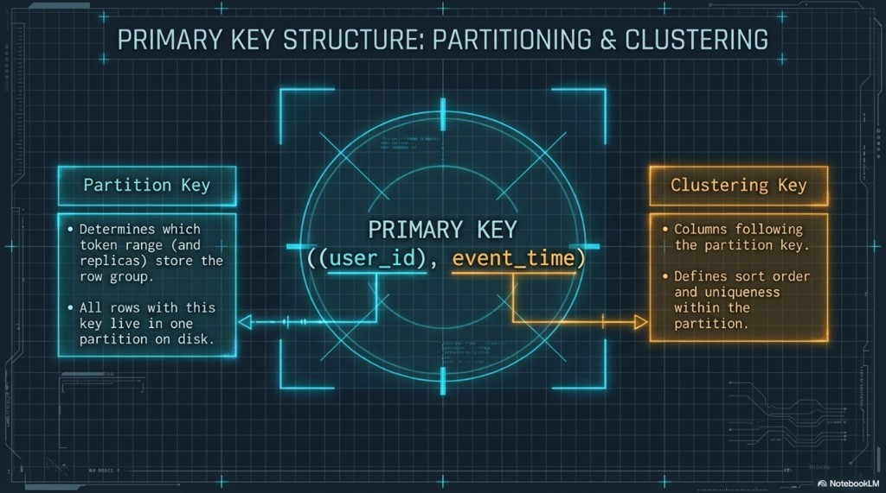

# DM 02 — Modeling process and primary key structure

Topics: **four-step process**, **partition key vs clustering**, **lab `events` example**.

**Terms:**

| Term | Meaning |
|------|---------|
| **Composite partition key** | Multiple columns in parentheses as the first `PRIMARY KEY` component, e.g. `PRIMARY KEY ((user_id, day), …)` — all listed columns identify **one** partition. |
| **Simple partition key** | A single column as the partition key: `PRIMARY KEY (user_id, …)`. |

**Previous:** [01-intro-and-paradigm.md](01-intro-and-paradigm.md). **Next:** [03-placement-and-partition-health.md](03-placement-and-partition-health.md).

---

## Cassandra data modeling process

Work **in order**:

1. **List access patterns** — For each pattern, note read/write frequency, **latency budget**, and whether you need **strong** or **eventual** behavior (tie to **CL** in [04-cap-and-tunable-consistency.md](../training/fundamentals/04-cap-and-tunable-consistency.md)).
2. **Choose partition key(s)** — So the query **narrows to one partition** (or a small, bounded set). Avoid cluster-wide scans.
3. **Define clustering columns** — **Row order** and uniqueness **inside** the partition (e.g. `event_time DESC` for “latest first”).
4. **Duplicate data when needed** — If two patterns need **different partition keys**, use **two tables** (or a carefully chosen materialized path). Accept denormalization.



**Takeaway:** If you cannot express a pattern as **known partition key + optional range on clustering**, you are still in purely relational thinking.

---

## Primary key: partitioning and clustering

The `PRIMARY KEY` has two roles:

- **Partition key** — Hashed to a **token** on the ring; decides **which replicas** store the partition. All rows sharing the same partition key live in **one partition** on disk.
- **Clustering key(s)** — Follow the partition key; define **sort order** on disk (default ascending; override with `CLUSTERING ORDER BY`) and **uniqueness** of each row within the partition.

Example aligned with the lab table `events` ([02-lab-environment.md](../training/fundamentals/02-lab-environment.md)):

```sql
PRIMARY KEY (user_id, event_time)
```

Here `user_id` is the partition key and `event_time` is the clustering key. If you use a **composite** partition key, extra parentheses group those columns, e.g. `PRIMARY KEY ((user_id, day), event_time)`.



**Takeaways:** **Partitioning** answers *where* data lives in the cluster; **clustering** answers *how rows are ordered* inside that partition.

---

## Next

[03-placement-and-partition-health.md](03-placement-and-partition-health.md) — consistent hashing, placement, and healthy vs hot partitions.
