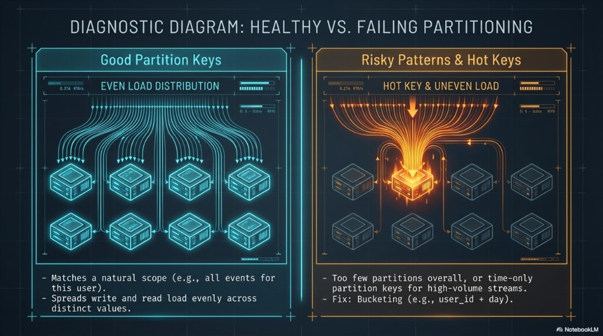

# DM 03 — Placement on the ring and partition health

Topics: **consistent hashing**, **`nodetool getendpoints`**, **RF/CL vs bad keys**, **even load vs hot partitions**, **bucketing**.

**Terms:**

| Term | Meaning |
|------|---------|
| **Hot partition** | A partition that receives a disproportionate share of reads/writes; its replicas become a bottleneck while other nodes stay idle. |
| **Bucketing** | Splitting what would be one huge partition into many smaller ones (e.g. add `day` or `hour` to the partition key). |

**Previous:** [02-process-and-primary-key.md](02-process-and-primary-key.md). **Next:** [04-clustering-and-wide-partitions.md](04-clustering-and-wide-partitions.md).

---

## Distributed placement via consistent hashing

The **partition key** is hashed to a **token** on the ring. That token determines **which nodes** hold replicas for that data. In the lab you can see concrete endpoints with:

```bash
docker exec cassandra-1 nodetool getendpoints lab_ks events '<user_id-uuid>'
```

(See [03-masterless-peers-and-placement.md](../architecture/03-masterless-peers-and-placement.md).)


**Law of placement:** **Placement and load follow the partition key.** **Replication factor (RF)** and **consistency level (CL)** do **not** fix a bad key—they only control **how many replicas** participate in each operation ([04-cap-and-tunable-consistency.md](../architecture/04-cap-and-tunable-consistency.md)).

---

## Healthy vs failing partitioning

**Good partition keys** often:

- Match a **natural query scope** (“all events for this user”).
- **Spread** read and write load across **many distinct** partition key values.

**Risky patterns:**

- **Too few partitions** (effectively everything under one key).
- **Time-only** partition keys on **high-volume** streams (all “current” traffic can hit one partition until the bucket rolls).

**Mitigation:** **Bucketing** — e.g. `(user_id, day)` instead of only `user_id` when per-user volume is huge, or combine dimensions so no single partition grows without bound.



**Takeaways:** Even load → horizontal scale. **Hot keys** → one node (and its replicas) glow while the rest of the cluster idles.

---

## Next

[04-clustering-and-wide-partitions.md](04-clustering-and-wide-partitions.md) — clustering order and wide partitions.
