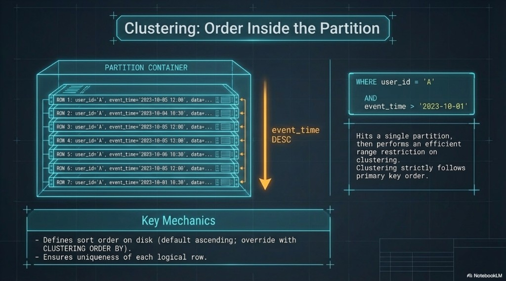
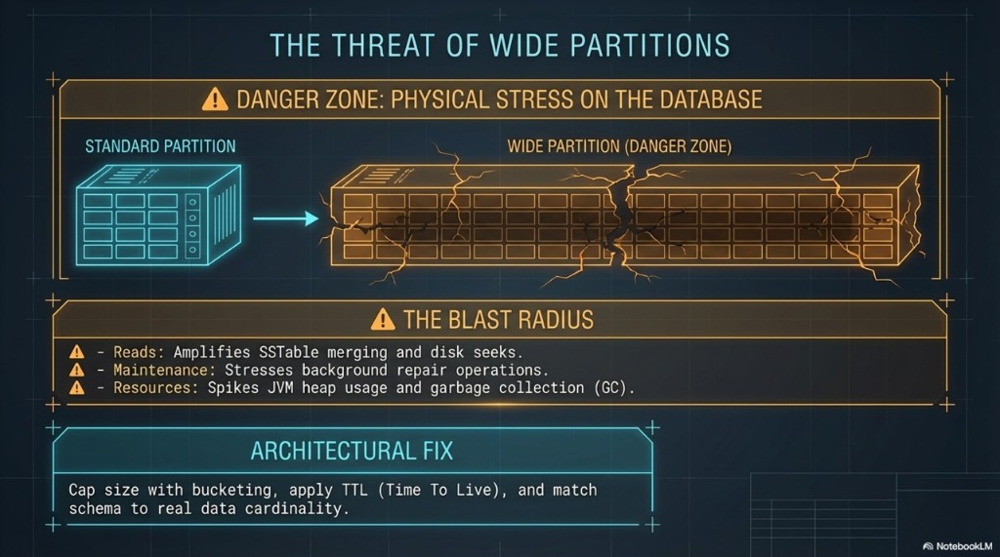

# 04 — Clustering order and the threat of wide partitions

Topics: **range queries on clustering**, **`CLUSTERING ORDER BY`**, **wide partition risks**, **bucketing, TTL, cardinality**, **labs: range query + clustering demo**.

**Terms:**

| Term | Meaning |
|------|---------|
| **Wide partition** | A partition that is very large in rows or payload size; stresses reads, repair, heap, and compaction. |

**Previous:** [03-placement-and-partition-health.md](03-placement-and-partition-health.md). **Next:** [05-tombstones-and-denormalization.md](05-tombstones-and-denormalization.md).

---

## Clustering: order inside the partition

Within one partition, rows are stored in **clustering key order** (unless you override with `CLUSTERING ORDER BY`). Efficient queries typically:

1. Restrict **`WHERE`** to the **partition key** (equality).
2. Optionally bound **clustering** columns with `=`, `>`, `<`, `BETWEEN` — **in primary key order**.

Example:

```sql
WHERE user_id = ?
  AND event_time > ?
```

That hits **one partition**, then applies an efficient **range** on clustering. Clustering **does not** give arbitrary sort orders on non-key columns—you only get what you declared in the `PRIMARY KEY` and clustering options.



**Takeaways:** Sort order is largely a **write-time** choice (schema); reads benefit when access patterns match.

---

## The threat of wide partitions

Partitions are not free to grow forever. **Very wide** partitions increase:

- **Reads** — More SSTable components to merge per read ([06-storage-engine-write-through-read.md](../architecture/06-storage-engine-write-through-read.md)).
- **Maintenance** — Heavier **repair** and compaction scope on that partition.
- **Resources** — **Heap** and **GC** pressure on coordinators and replicas.

**Mitigations:**

- **Bucketing** — Split logical data across more partition keys (time shards, hashes, etc.).
- **TTL** — Expire old data where the product allows it.
- **Realistic cardinality** — Model for actual volumes, not “one partition per global type.”



**Takeaways:** Treat unbounded partition growth as a **design bug** unless you have measured otherwise.

---

## Lab A — Range query on clustering

**Goal:** Restrict **`event_time`** after fixing **`user_id`**.

**Environment:** [Docker Compose](README.md#lab-cluster-docker-compose); `lab_ks.events` with sample rows (02).

1. `USE lab_ks;`
2. Pick a `user_id` that has rows. Run:

   ```sql
   SELECT * FROM events
   WHERE user_id = <your-user-id>
     AND event_time > '2020-01-01 00:00:00+0000'
   LIMIT 50;
   ```

**Deliverable:** Explain why this stays **partition-scoped** and uses a **clustering** range.

---

## Lab B — `CLUSTERING ORDER BY` (optional)

**Goal:** See how **descending** clustering changes read order (write-time choice).

**Environment:** same cluster; run in `lab_ks`.

1. Create a small demo table (drop later if you like):

   ```sql
   USE lab_ks;

   CREATE TABLE IF NOT EXISTS dm_cluster_demo (
     demo_id uuid,
     seq int,
     note text,
     PRIMARY KEY (demo_id, seq)
   ) WITH CLUSTERING ORDER BY (seq DESC);

   INSERT INTO dm_cluster_demo (demo_id, seq, note) VALUES (123e4567-e89b-12d3-a456-426614174000, 1, 'first');
   INSERT INTO dm_cluster_demo (demo_id, seq, note) VALUES (123e4567-e89b-12d3-a456-426614174000, 2, 'second');

   SELECT * FROM dm_cluster_demo WHERE demo_id = 123e4567-e89b-12d3-a456-426614174000;
   ```

**Deliverable:** Confirm **seq** order on read vs ascending default. When would **DESC** help a “latest first” UI?

---

## Next

[05-tombstones-and-denormalization.md](05-tombstones-and-denormalization.md) — deletes, tombstones, and duplication across tables.
