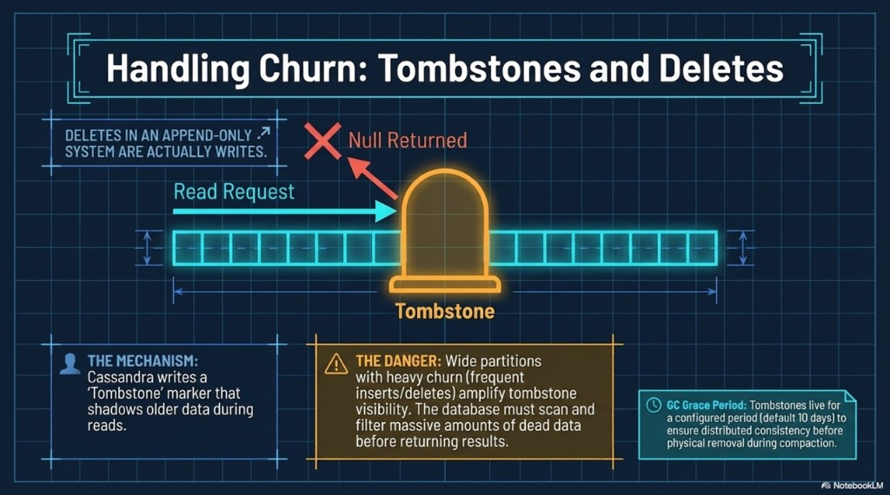

# 05 — Tombstones, churn, and denormalization

Topics: **deletes as writes**, **tombstones and `gc_grace_seconds`**, **fan-out writes to multiple tables**, **labs: DELETE + `events_by_day`**.

**Terms:**

| Term | Meaning |
|------|---------|
| **Tombstone** | A delete marker written like any other write; older cells are **shadowed** at read time until compaction can remove them after **GC grace**. |

**Previous:** [04-clustering-and-wide-partitions.md](04-clustering-and-wide-partitions.md). **Next:** [06-anti-patterns.md](06-anti-patterns.md).

---

## Handling churn: tombstones and deletes

Cassandra is **append-oriented** (LSM): a **delete** is **not** an in-place erase—it is a **write** of a **tombstone**. Reads merge live cells and tombstones; **last write wins** by timestamp. Tombstones stay visible to the storage layer for **`gc_grace_seconds`** (default often **10 days**) so a temporarily offline replica can still learn about the delete—only then can compaction discard data safely.

**Modeling impact:** **Wide partitions** with **heavy insert/delete churn** force reads to **scan and reconcile** many dead markers—latency suffers. Pair partition sizing with delete/TTL strategy ([06-storage-engine-write-through-read.md](../architecture/06-storage-engine-write-through-read.md)).



**Takeaways:** Deletes have **ongoing read cost** until tombstones compact away; design partitions and churn accordingly.

---

## Scale via denormalization: duplication is a feature

**Joins** are not the primary OLTP mechanism in Cassandra: if you need “by user” **and** “by day” efficiently, you typically maintain **two tables** with different partition keys and **duplicate** column values your queries need.

Example pattern:

| Table | Partition key | Serves |
|-------|----------------|--------|
| `events_by_user` | `user_id` | “History for user A.” |
| `events_by_day` | `date` (or bucket) | “Everything that happened on this day.” |

One application write can **fan out** to both tables in one request path (or via a pipeline). **Correctness** and **update workflows** are **application responsibilities**—the database will not transparently normalize for you.


**Takeaways:** Duplication trades **storage and discipline** for **predictable, partition-local reads**.

---

## Lab A — Delete and tombstone behavior

**Goal:** A **delete** is a **write** of a tombstone; reads merge it away.

**Environment:** [Docker Compose](README.md#lab-cluster-docker-compose); `lab_ks.events`.

1. Insert a row with a **known** `user_id`:

   ```sql
   USE lab_ks;
   INSERT INTO events (user_id, event_time, payload)
   VALUES (123e4567-e89b-12d3-a456-426614174099, '2020-06-01 12:00:00+0000', 'dm05-delete-me');
   ```

2. `DELETE` that exact row (full primary key: `user_id` + `event_time`).
3. `SELECT * FROM events WHERE user_id = 123e4567-e89b-12d3-a456-426614174099;`

**Deliverable:** One sentence: why the row “disappears” without an immediate physical erase on disk (see [architecture/06-storage-engine-write-through-read.md](../architecture/06-storage-engine-write-through-read.md)).

---

## Lab B — Denormalized table + dual write

**Goal:** Second **`PRIMARY KEY`** for another access pattern.

**Environment:** same cluster.

1. Create `events_by_day` (if you already created it in module **05** or **07**, skip or use `DROP TABLE` first on a throwaway cluster):

   ```sql
   CREATE TABLE IF NOT EXISTS events_by_day (
     day text,
     event_time timestamp,
     user_id uuid,
     payload text,
     PRIMARY KEY (day, event_time)
   ) WITH CLUSTERING ORDER BY (event_time DESC);
   ```

2. Insert **one** logical event into **both** `events` **and** `events_by_day` (same `user_id`, `event_time`, `payload`; set `day` to a string like `'2025-04-01'` that matches the event’s calendar day).
3. Query by user: `SELECT * FROM events WHERE user_id = ...`
4. Query by day: `SELECT * FROM events_by_day WHERE day = '2025-04-01' LIMIT 20;`

**Deliverable:** What must a real application do on every write to keep both tables consistent?

---

## Next

[06-anti-patterns.md](06-anti-patterns.md) — secondary indexes, `ALLOW FILTERING`, and LWT.
