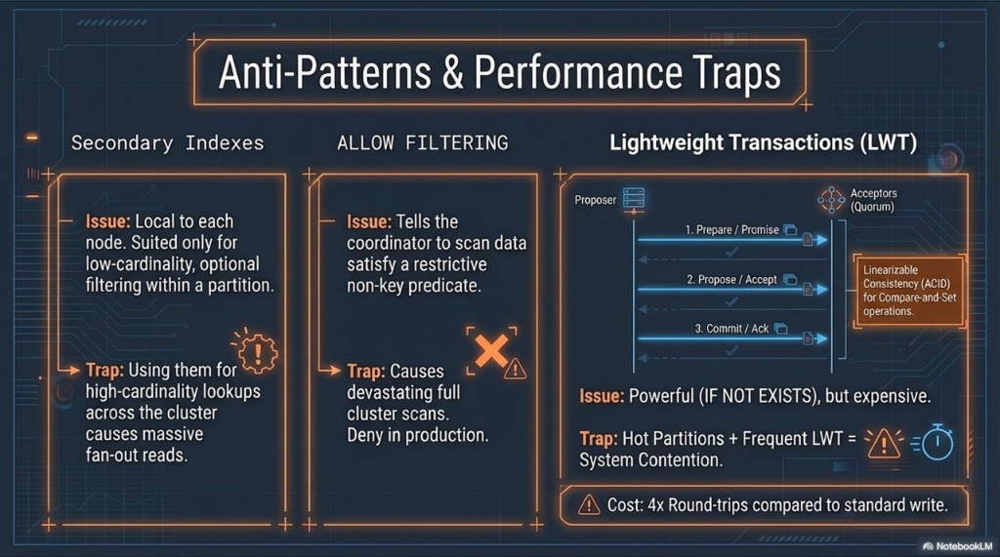

# DM 05 — Tombstones, churn, and denormalization

Topics: **deletes as writes**, **tombstones and `gc_grace_seconds`**, **fan-out writes to multiple tables**.

**Terms:**

| Term | Meaning |
|------|---------|
| **Tombstone** | A delete marker written like any other write; older cells are **shadowed** at read time until compaction can remove them after **GC grace**. |

**Previous:** [04-clustering-and-wide-partitions.md](04-clustering-and-wide-partitions.md). **Next:** [06-anti-patterns.md](06-anti-patterns.md).

---

## Handling churn: tombstones and deletes

Cassandra is **append-oriented** (LSM): a **delete** is **not** an in-place erase—it is a **write** of a **tombstone**. Reads merge live cells and tombstones; **last write wins** by timestamp. Tombstones stay visible to the storage layer for **`gc_grace_seconds`** (default often **10 days**) so a temporarily offline replica can still learn about the delete—only then can compaction discard data safely.

**Modeling impact:** **Wide partitions** with **heavy insert/delete churn** force reads to **scan and reconcile** many dead markers—latency suffers. Pair partition sizing with delete/TTL strategy ([06-storage-engine-write-through-read.md](../architecture/06-storage-engine-write-through-read.md)).

**Takeaways:** Deletes have **ongoing read cost** until tombstones compact away; design partitions and churn accordingly.

---

## Scale via denormalization: duplication is a feature

**Joins** are not the primary OLTP mechanism in Cassandra: if you need “by user” **and** “by day” efficiently, you typically maintain **two tables** with different partition keys and **duplicate** column values your queries need.

Example pattern:

| Table | Partition key | Serves |
|-------|----------------|--------|
| `events_by_user` | `user_id` | “History for user A.” |
| `events_by_day` | `date` (or bucket) | “Everything that happened on this day.” |

One application write can **fan out** to both tables in one request path (or via a pipeline). **Correctness** and **update workflows** are **application responsibilities**—the database will not transparently normalize for you.

**Takeaways:** Duplication trades **storage and discipline** for **predictable, partition-local reads**.

---

## Next

[06-anti-patterns.md](06-anti-patterns.md) — secondary indexes, `ALLOW FILTERING`, and LWT.
