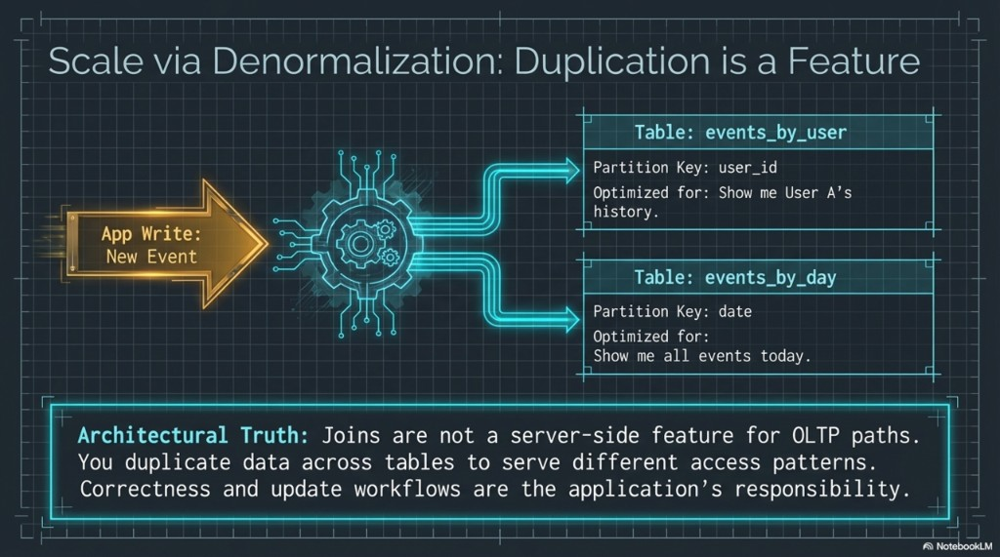

# DM 06 — Anti-patterns and performance traps

Topics: **secondary indexes**, **`ALLOW FILTERING`**, **lightweight transactions (LWT)** and hot keys.

**Terms:**

| Term | Meaning |
|------|---------|
| **Secondary index** | An index that is **distributed** with caveats: often poor for **high-cardinality** “find anywhere in the cluster” queries—can fan out to **every** node. |
| **LWT** | Lightweight transaction (`IF`, `IF NOT EXISTS`) using **Paxos**-style rounds—**several** round-trips vs a normal write ([07-self-healing-lwt-and-summary.md](../training/fundamentals/07-self-healing-lwt-and-summary.md)). |

**Previous:** [05-tombstones-and-denormalization.md](05-tombstones-and-denormalization.md). **Next:** [07-checklist-labs-and-blueprint.md](07-checklist-labs-and-blueprint.md).

---

## When convenience becomes a trap

**Secondary indexes**

- Useful in **narrow** cases (often **low cardinality**, or scoped queries where the index is not doing a cluster-wide probe).
- **Trap:** High-cardinality lookups “by email across the whole database” via secondary index → **fan-out** to many nodes → high latency and load. Prefer a table whose **partition key** matches the lookup.

**`ALLOW FILTERING`**

- Tells the coordinator it may **scan** tables to satisfy predicates on **non-partition-key** columns.
- **Trap:** On large data sets this becomes **full partition or cluster scans**. Treat production use with extreme skepticism—often a sign the **schema is wrong** for that query.

**Lightweight transactions**

- Give **linearizable** conditional updates (compare-and-set semantics).
- **Cost:** Roughly **~4×** the round-trips of a simple write in typical discussions—use **sparingly**.
- **Trap:** **Hot partition** + **frequent LWT** → **contention** and tail latency. Prefer idempotent designs and partition keys that spread serializing work.

**Takeaways:** If the hot query needs a column, that column usually belongs in a **primary key** or a **dedicated denormalized table**, not behind an index + filter as the main path.

---

## Next

[07-checklist-labs-and-blueprint.md](07-checklist-labs-and-blueprint.md) — pre-flight checklist, capstone visuals, and labs.
