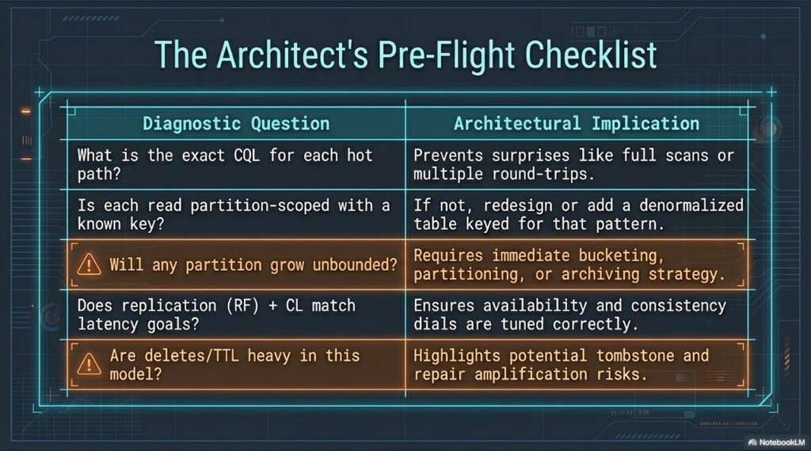
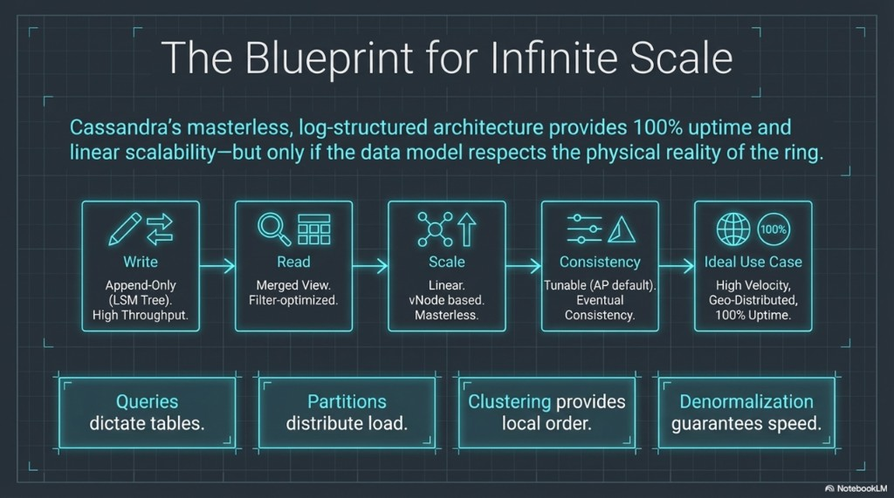

# DM 07 — Pre-flight checklist, blueprint, and labs

Topics: **architect checklist**, **how modeling fits the full stack**, **hands-on labs**, **further reading**.

**Previous:** [06-anti-patterns.md](06-anti-patterns.md).

---

## The architect’s pre-flight checklist

Before you ship a schema to production, walk through these **diagnostic questions**:

| Diagnostic question | Architectural implication |
|---------------------|-----------------------------|
| What is the **exact CQL** for each hot path? | Avoid surprise **full scans** or extra round-trips. |
| Is each read **partition-scoped** with a **known** key? | If not, **redesign** or add a **denormalized** table for that pattern. |
| Will **any** partition grow **unbounded**? | You need **bucketing**, **archiving**, or a different partition strategy. |
| Does **RF** + **CL** match **latency** and **durability** goals? | Tune per use case ([04-cap-and-tunable-consistency.md](../architecture/04-cap-and-tunable-consistency.md)). |
| Are **deletes** / **TTL** heavy? | Expect **tombstone** and **repair** amplification ([06-storage-engine-write-through-read.md](../architecture/06-storage-engine-write-through-read.md)). |



---

## Blueprint for infinite scale (and where modeling fits)

Cassandra’s **masterless**, **log-structured** stack can support **very high** availability and **linear** scale-out **when** the data model respects the **ring** and storage realities:

| Flow | Role |
|------|------|
| **Write** | Append-only **LSM** — high ingest throughput. |
| **Read** | Merged view — filters and caches help, but **partition scope** still dominates. |
| **Scale** | **Linear**, **vnode**-based, **masterless**. |
| **Consistency** | **Tunable**, AP-leaning defaults, **eventual** convergence between replicas. |
| **Ideal fit** | **High velocity**, **geo-distributed**, **uptime**-sensitive workloads **when queries match partitions**. |

**Core modeling principles:** **Queries dictate tables.** **Partitions** distribute load. **Clustering** provides **local** order. **Denormalization** buys **speed** at the cost of duplicated data and app-side consistency rules.



---

## Lab A — Relate `events` to placement

**Goal:** Tie the lab table to **partition key** and replicas.

1. In cqlsh: `USE lab_ks;` then `DESCRIBE TABLE events;`
2. Identify **partition key** vs **clustering** column.
3. Insert a row with a **fixed** `user_id` (reuse a UUID from [03-masterless-peers-and-placement.md](../architecture/03-masterless-peers-and-placement.md) if you like).
4. On the host: `docker exec cassandra-1 nodetool getendpoints lab_ks events '<that-user-id>'`

**Deliverable:** Two sentences: (1) what is hashed to the ring, (2) how clustering affects row order inside that partition.

---

## Lab B — Supported vs unsupported predicates

**Goal:** See why **non-key** filters are painful.

```sql
USE lab_ks;
-- Natural shape: partition key + optional clustering bound:
SELECT * FROM events WHERE user_id = <a-uuid-you-inserted> LIMIT 10;
```

Try (use a `payload` value you know exists):

```sql
SELECT * FROM events WHERE payload = 'some-payload' ALLOW FILTERING;
```

**Deliverable:** Explain why the first query aligns with **storage layout** and why the second is **risky at scale** (even if it works on tiny data).

---

## Lab C — Sketch a second access pattern

**Goal:** Practice **denormalization** for a new query.

You need “recent events across **all** users for a **given day**,” sorted by time. The existing `events` table is keyed by `user_id`, so it does **not** efficiently answer “all users, one day.”

**Deliverable:** Propose a **second table**’s `PRIMARY KEY` (and clustering order) that partitions by **day** or another bucket so one query reads **one** (or a few) partitions. Note that the app must **write to both** tables (or an equivalent pipeline) and how you avoid an **unbounded** hot partition if a bucket is still too large.

Example shape (illustrative):

```sql
CREATE TABLE IF NOT EXISTS events_by_day (
  day text,
  event_time timestamp,
  user_id uuid,
  payload text,
  PRIMARY KEY (day, event_time)
) WITH CLUSTERING ORDER BY (event_time DESC);
```

---

## Further reading (official)

- Apache Cassandra documentation — *Data modeling* (conceptual, logical, physical). [https://cassandra.apache.org/doc/stable/cassandra/developing/data-modeling/index.html](https://cassandra.apache.org/doc/stable/cassandra/developing/data-modeling/index.html)

---

## Course navigation

Full course overview: [../README.md](../README.md#learning-path). Data modeling index: [README.md](README.md).

To connect back to operations: [03-masterless-peers-and-placement.md](../architecture/03-masterless-peers-and-placement.md) (ring), [06-storage-engine-write-through-read.md](../architecture/06-storage-engine-write-through-read.md) (SSTables, tombstones).
