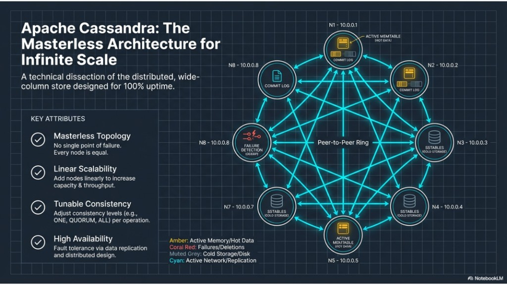
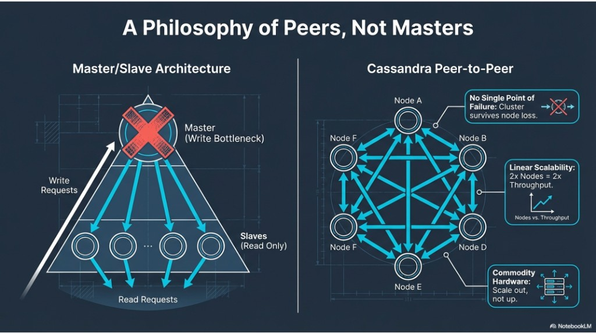
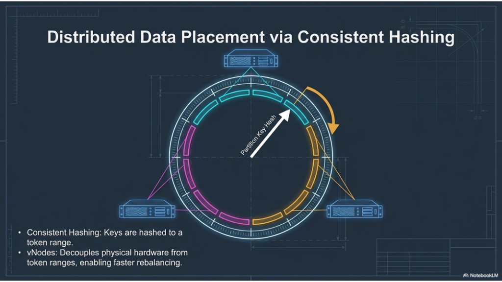

# 04 — Masterless architecture, peers, and data placing

Topics: **masterless topology**, **peers not masters**, **consistent hashing / vNodes / replication**.

**Previous:** [03-data-modeling-essentials.md](03-data-modeling-essentials.md). **Next:** [05-cap-and-tunable-consistency.md](05-cap-and-tunable-consistency.md).

---

## 1. Masterless architecture

**What it means:** In a Cassandra cluster, **no node is special**. There is no primary or metadata master the whole system depends on. Every node can accept reads and writes for the data it owns (and coordinate requests). The design targets **high availability** and **no single point of failure** from topology alone.

**How it shows up:** Nodes form a **peer-to-peer ring**. They communicate over the network (replication, gossip). On each node you still have **commit logs**, **memtables**, and **SSTables**—but **role-wise**, nodes are peers.

**Why it matters:** If one node fails, others continue serving traffic. You scale by **adding nodes**, not by buying one bigger “master” machine.



**Takeaways:** No master; every node can serve; replication + gossip keep the cluster coherent; tunable consistency applies per operation.

---

## 2. Peers, not masters

**What it means:** Unlike **master/slave** designs (single writer = bottleneck and **single point of failure**), in Cassandra **every node is a peer**: writes and reads are not funneled through one machine.

**Benefits:**

- **No single point of failure** — the cluster survives loss of individual nodes.
- **Linear scalability** — more nodes → more aggregate throughput (workload-dependent).
- **Commodity hardware** — scale **out** with many servers instead of scaling **up** one huge box.



**Takeaways:** Think **token ranges**, **replication factor**, and **consistency level**, not “one primary for all writes.”

---

## 3. Data placing

**What it means:** Cassandra places each **partition** using the **partition key**:

- Hashing maps the key to a position on the **token ring**.
- **vNodes** spread each physical node across many small ranges so rebalancing is smoother when topology changes.
- **Replication** picks additional replicas per your strategy (`SimpleStrategy` in this lab; `NetworkTopologyStrategy` in real multi-DC deployments).



**Takeaways:** Partition key design drives distribution; multi-DC uses **NetworkTopologyStrategy** and a matching **snitch**.

---

## Lab A — Prove “any node is a coordinator”

**Goal:** Same cluster view and CQL work from **cassandra-2** as from **cassandra-1**.

1. From the host:

   ```bash
   docker exec -it cassandra-2 cqlsh cassandra-2 9042
   ```

2. Run:

   ```sql
   USE lab_ks;
   SELECT cluster_name FROM system.local;
   DESCRIBE TABLES;
   ```

**Deliverable:** Confirm you see `lab_ks.events` when connected to **node 2**, not only node 1.

---

## Lab B — Token ring and endpoints for a partition

**Goal:** See which nodes hold replicas for a concrete partition.

1. In cqlsh (any node), insert a row with a **known** `user_id`:

   ```sql
   USE lab_ks;

   INSERT INTO events (user_id, event_time, payload)
  VALUES (123e4567-e89b-12d3-a456-426614174000, toTimestamp(now()), 'placement-lab');
   ```

2. On the **host**, run (replace nothing if you used the UUID above):

   ```bash
   docker exec cassandra-1 nodetool getendpoints lab_ks events 123e4567-e89b-12d3-a456-426614174000
   ```

**Deliverable:** List the three endpoints (or fewer if RF/keyspace mismatch—fix RF to 3 if needed). Relate the output to **“partition key → token → replicas.”**

---

## Lab C — Optional: inspect the ring

```bash
docker exec cassandra-1 nodetool ring lab_ks
```

**Deliverable:** One sentence: how does this output relate to **vNodes** and **token ranges**?

---

## Next

[05-cap-and-tunable-consistency.md](05-cap-and-tunable-consistency.md)
