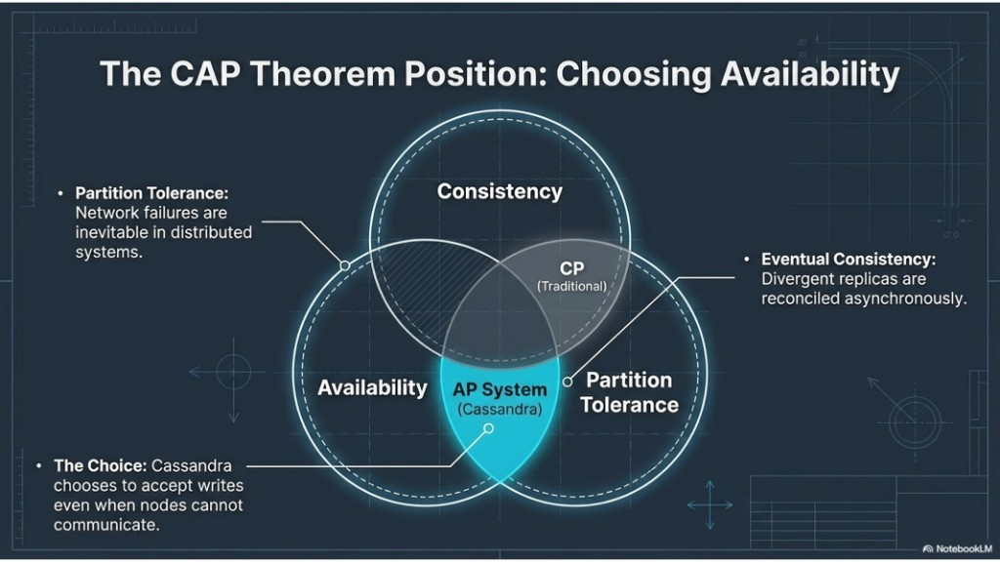
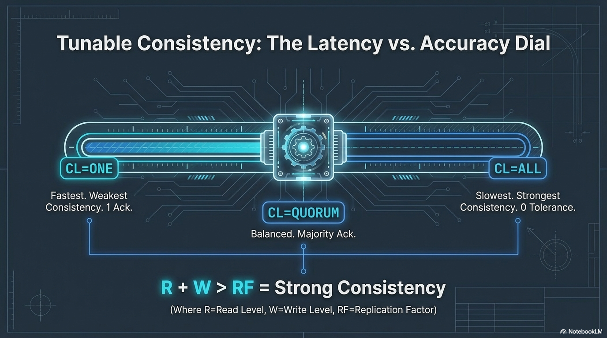

# 05 — CAP theorem and tunable consistency

Topics: **CAP / AP framing**, **consistency levels**, **R + W > RF** intuition.

**Previous:** [04-masterless-peers-and-placement.md](04-masterless-peers-and-placement.md). **Next:** [06-gossip-and-topology.md](06-gossip-and-topology.md).

---

## 4. CAP theorem

**CAP (high level):** Under a **network partition**, you cannot maximize both **strong linearizable consistency everywhere** and **availability** for every operation without trade-offs.

**Cassandra’s usual framing:** Described as **AP-leaning**: it prioritizes **availability** and **partition tolerance**, and uses **replication**, **repair**, and **tunable consistency** so replicas **eventually** agree.

**Eventual consistency:** Divergent replicas reconcile **asynchronously**. Under partitions, writes may still proceed on available sides; **consistency levels** express how much agreement you require per operation.



**Takeaways:** “AP default” does not mean “no consistency”—it means **you choose** per operation.

---

## 5. Tunable consistency

**Consistency level (CL)** defines **how many replicas** must respond before a read or write succeeds.

| Level | Behavior (simplified) |
|-------|----------------------|
| **ONE** | One replica acknowledgment — lowest latency, higher staleness risk. |
| **QUORUM** | Majority of replicas (e.g. 2 of 3 when RF=3). |
| **ALL** | Every replica — strongest alignment; any down node fails the operation. |

**Read-your-writes intuition:** **R + W > RF** (with quorums) implies overlapping quorums so a reader can see the latest write.



**Takeaways:** CL is a **latency vs correctness** knob; defaults and per-statement overrides should match your app.

---

## Lab A — Set consistency levels in cqlsh

**Goal:** Feel the difference between **ONE** and **QUORUM** on a healthy three-node cluster.

In **cqlsh**:

```sql
USE lab_ks;

CONSISTENCY ONE;
SELECT * FROM events LIMIT 5;

CONSISTENCY QUORUM;
SELECT * FROM events LIMIT 5;
```

**Deliverable:** Note current CL in the cqlsh prompt after each `CONSISTENCY` command (`cqlsh` shows it).

---

## Lab B — Trace a write at QUORUM vs ONE

**Goal:** See coordinator behavior with tracing (verbose; use small tests).

```sql
CONSISTENCY QUORUM;
TRACING ON;

INSERT INTO events (user_id, event_time, payload)
VALUES (123e4567-e89b-12d3-a456-426614174001, toTimestamp(now()), 'trace-quorum');

TRACING OFF;
```

Repeat with `CONSISTENCY ONE` and a new `user_id` ending in `002`.

**Deliverable:** Two or three bullets: what differs in trace output (number of replica replies / stages)—even qualitatively is fine.

---

## Lab C — (Advanced) Partition behavior

**Warning:** Stopping nodes while testing can leave hints and repair backlog—only on a **throwaway** cluster or after backup.

If you are comfortable:

1. `docker compose stop cassandra-3`
2. Try `CONSISTENCY ALL;` then `INSERT ...` — expect failure if not enough replicas.
3. `CONSISTENCY ONE;` — insert may succeed.
4. `docker compose start cassandra-3` and wait for **UN**.

**Deliverable:** Short note: how does this illustrate **CAP** and **tunable** behavior?

---

## Next

[06-gossip-and-topology.md](06-gossip-and-topology.md)
