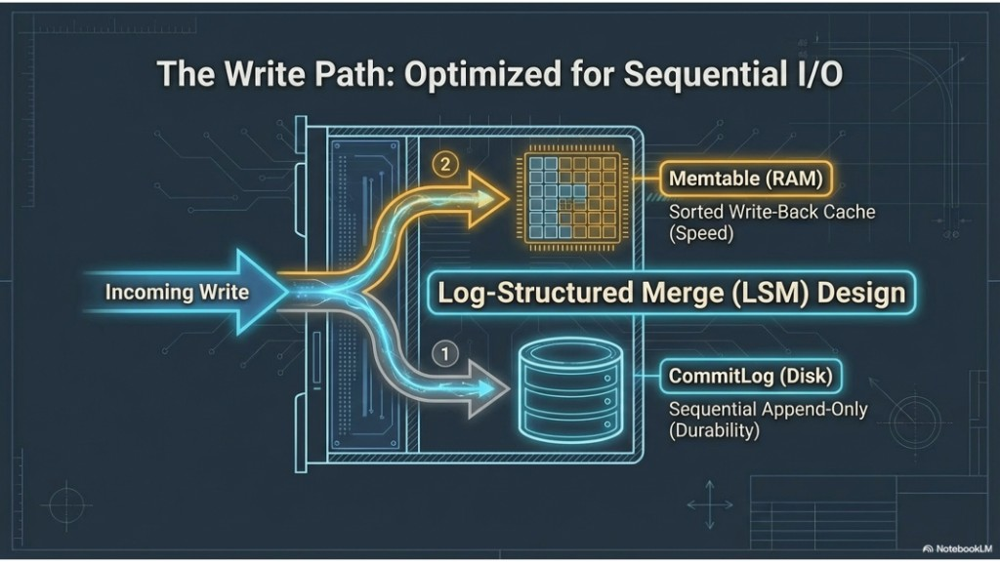
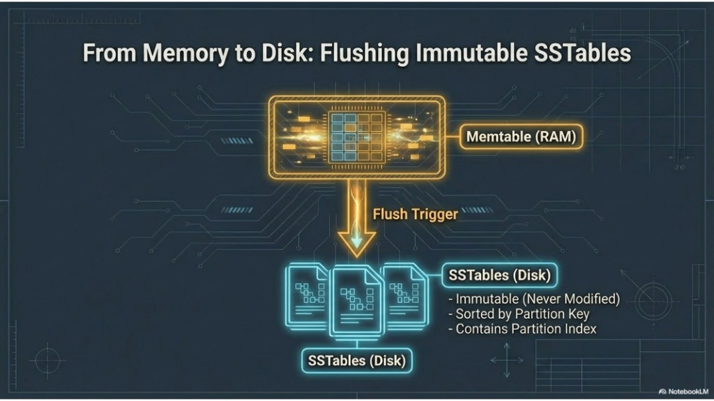
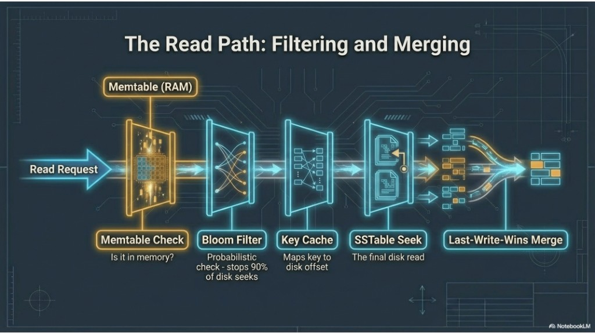
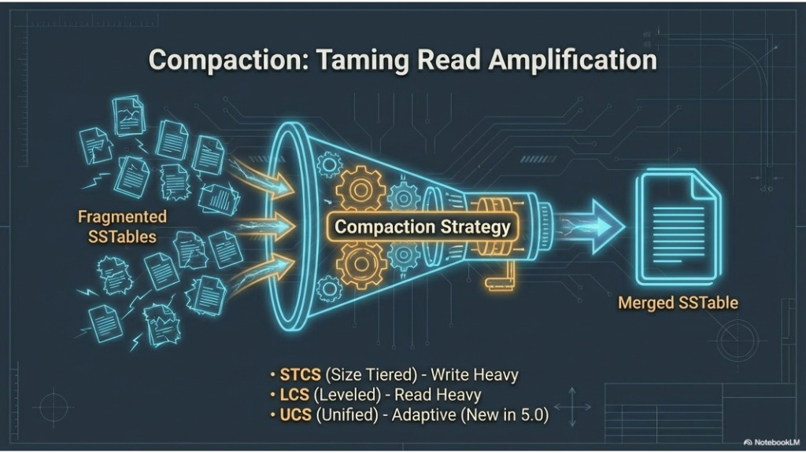
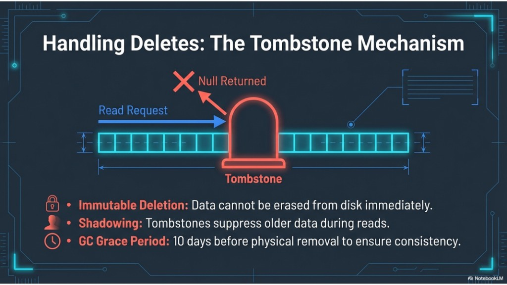

# 06 — Storage engine: write path, memory to disk, read path, compaction, tombstones

Topics: **LSM write path**, **memtable → SSTable flush**, **read path (Bloom, merge)**, **compaction strategies**, **tombstones**.

**Terms:**

| Term | Meaning |
|------|---------|
| **LSM** | Log-structured merge tree: writes append in batches and are merged later (no random in-place edits to old files). |
| **SSTable** | Sorted string table (immutable on-disk segment). |
| **STCS** | Size-tiered compaction. |
| **LCS** | Leveled compaction. |
| **UCS** | Unified compaction (adaptive; newer releases). |

**Previous:** [05-gossip-and-topology.md](05-gossip-and-topology.md). **Next:** [07-self-healing-lwt-and-summary.md](07-self-healing-lwt-and-summary.md).

---

## 8. Write path

Writes use **LSM** semantics: **append-only commit log** (durability) plus **memtable** (sorted in-memory buffer per table). **Memtables** flush to new **SSTables**; existing SSTables are not updated in place.

Compared with many **row-oriented** stores that **update** pages in place on disk, LSM trees **append** and **merge** later, which favors **sequential I/O** and high ingest rates (at the cost of read-path merging and compaction work).



**Takeaways:** Fast sequential writes; crash recovery replays the commit log.

---

## 9. Memory to disk

When memtables flush, data becomes **immutable SSTables** (sorted by partition key, with indexes). Updates are new SSTables over time; **compaction** merges them.



**Takeaways:** Immutability drives **tombstones** and **read merge** behavior.

---

## 10. Read path

Reads check the **memtable** first, then **SSTables** on disk. **Bloom filters** cheaply skip SSTables that cannot contain the partition; the **key cache** speeds index lookups. **LWW** = **last-write-wins** merge by **timestamp** when multiple versions exist.



**Takeaways:** Minimize SSTable reads via caches and compaction strategy choice.

---

## 11. Compaction

Compaction merges SSTables to reduce **read amplification** (too many files to check per read). **STCS** (size-tiered) suits write-heavy workloads; **LCS** (leveled) suits read-heavy patterns; **UCS** (unified) is adaptive in newer releases.



**Takeaways:** Strategy affects write amplification vs read cost; tune per table workload.

---

## 12. Tombstones

**Delete** = write a **tombstone** (a marker row). **`gc_grace_seconds`** = **garbage-collection grace**: how long tombstones must stay before compaction can drop them, so offline replicas can still learn about the delete.



**Takeaways:** Deletes cost like writes; wide partitions with heavy deletes need care.

---

## Lab A — Flush and list SSTables

**Goal:** Force **memtable → SSTable** and see on-disk artifacts.

In cqlsh:

```sql
USE lab_ks;
INSERT INTO events (user_id, event_time, payload)
VALUES (aaaaaaaa-bbbb-cccc-dddd-eeeeeeeeeeee, toTimestamp(now()), 'flush-lab');
```

On the **host**:

```bash
docker exec cassandra-1 nodetool flush lab_ks events
docker exec cassandra-1 nodetool listsnapshots
docker exec cassandra-1 ls -la /var/lib/cassandra/data/lab_ks/events-*/ | head -20
```

(The exact path includes a table UUID; `find` if needed:)

```bash
docker exec cassandra-1 find /var/lib/cassandra/data/lab_ks -name "*.Data.db" 2>/dev/null | head
```

**Deliverable:** Confirm at least one `*-Data.db` file exists after flush.

---

## Lab B — Read tracing

```sql
CONSISTENCY QUORUM;
TRACING ON;
SELECT * FROM events WHERE user_id = 123e4567-e89b-12d3-a456-426614174000 LIMIT 5;
TRACING OFF;
```

**Deliverable:** From the trace, name one stage related to **SSTable** / **memtable** (wording may vary by version).

---

## Lab C — Compaction stats

```bash
docker exec cassandra-1 nodetool compactionstats
docker exec cassandra-1 nodetool tablestats lab_ks events
```

**Deliverable:** Note **SSTable count** for `lab_ks.events` before and after optional `nodetool compact lab_ks events` (compaction can be I/O heavy—optional on small labs).

---

## Lab D — Tombstones in practice

```sql
USE lab_ks;

INSERT INTO events (user_id, event_time, payload)
VALUES (123e4567-e89b-12d3-a456-426614174099, '2020-01-01 00:00:00+0000', 'tombstone-lab');

DELETE FROM events WHERE user_id = 123e4567-e89b-12d3-a456-426614174099 AND event_time = '2020-01-01 00:00:00+0000';

SELECT * FROM events WHERE user_id = 123e4567-e89b-12d3-a456-426614174099;
```

Optionally run `TRACING ON` before the `SELECT` and look for tombstone-related metrics (wording varies by version).

**Deliverable:** Explain in one sentence why **delete** did not “erase a row on disk” immediately.

---

## Next

[07-self-healing-lwt-and-summary.md](07-self-healing-lwt-and-summary.md)
