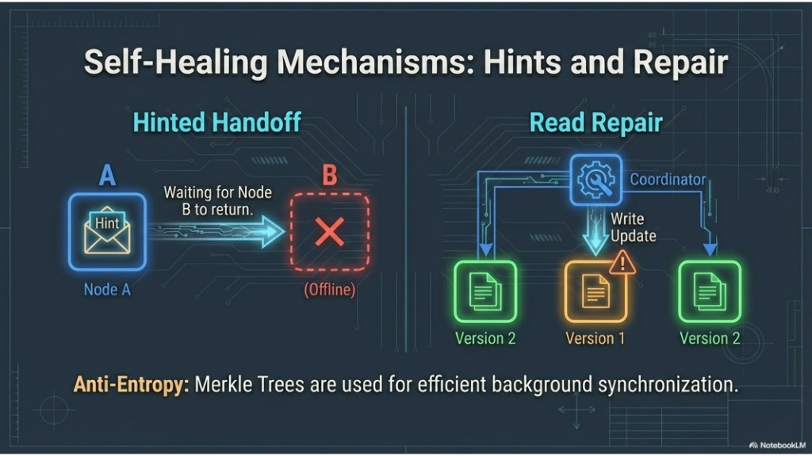
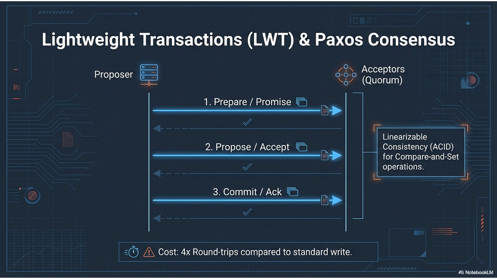
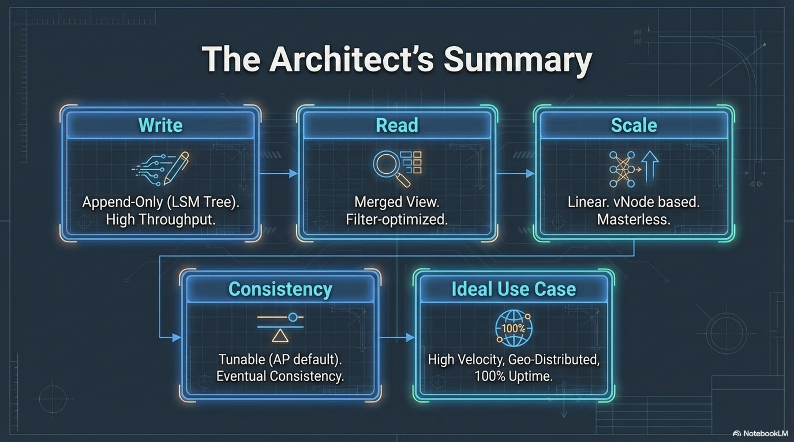

# 07 — Self-healing (hints & repair), LWT, summary

Topics: **hinted handoff**, **read repair**, **anti-entropy repair**, **lightweight transactions (Paxos)**, **architect summary**.

**Previous:** [06-storage-engine-write-through-read.md](06-storage-engine-write-through-read.md).

---

## 13. Self-healing: hints and repairs

- **Hinted handoff:** If a replica is **temporarily down**, the coordinator may store a **hint** and deliver when the peer returns.
- **Read repair:** On read, if replicas disagree, the coordinator can **write back** the latest version to stale replicas (policy-dependent).
- **Anti-entropy repair:** `nodetool repair` (Merkle trees / incremental repair in modern versions) fixes divergence without relying on reads.



**Takeaways:** Operational hygiene: schedule **repair**; understand **read repair** impact on read latency.

---

## 14. LWT (Lightweight Transactions)

**LWT** provides **linearizable** conditional updates (`IF`, `IF NOT EXISTS`) via **Paxos-style** rounds—several network round-trips vs a normal write.

**Cost:** Often **~4×** round-trips vs a simple write—use only where needed.



**Takeaways:** Hot partitions + LWT = contention; prefer idempotent design where possible.

---

## 15. Summary

| Theme | One-liner |
|-------|-----------|
| **Write** | Append-only **LSM**; high throughput. |
| **Read** | **Merged** view; Bloom filters, caches, SSTable seeks. |
| **Scale** | **Linear**, **vNode**-based, **masterless**. |
| **Consistency** | **Tunable**; **AP**-leaning default with **eventual** convergence. |
| **Ideal fit** | **High velocity**, **geo-distributed**, **uptime**-sensitive workloads when the model fits. |



---

## Lab A — Hinted handoff (observation)

**Goal:** See hints-related metrics (exact names vary by version).

```bash
docker exec cassandra-1 nodetool tpstats | grep -i hint
docker exec cassandra-1 nodetool netstats
```

Optionally: stop `cassandra-3` for ~30s, run a few `INSERT`s with `CONSISTENCY QUORUM` (may fail if quorum unavailable—try `ONE` only if you understand the trade-off), start node back, re-check.

**Deliverable:** Note whether **HintedHandOff** (or similar) appears in `tpstats` and what you infer.

---

## Lab B — Repair (small scope)

**Warning:** Full cluster repair is heavy. For training, **primary range repair on one node** after you understand ops impact:

```bash
docker exec cassandra-1 nodetool repair lab_ks --full
```

On large data this is slow; with the tiny lab dataset it should finish quickly.

**Deliverable:** Paste exit code / final line from repair, or summarize “completed without error.”

**Production note:** Prefer **incremental repair** and **subrange** strategies per your Cassandra version and ops guide—not covered in detail here.

---

## Lab C — Lightweight transaction

In **cqlsh**:

```sql
USE lab_ks;

CREATE TABLE IF NOT EXISTS inventory (
  sku text PRIMARY KEY,
  qty int
);

INSERT INTO inventory (sku, qty) VALUES ('lwt-demo', 10);

UPDATE inventory SET qty = 11 WHERE sku = 'lwt-demo' IF qty = 10;
SELECT * FROM inventory;

UPDATE inventory SET qty = 99 WHERE sku = 'lwt-demo' IF qty = 10;
SELECT * FROM inventory;
```

**Deliverable:** Which `UPDATE` applied, and why? Relate to **compare-and-set** / Paxos.

---

## Lab D — Capstone checklist

Without running new commands, write a short answer for each:

1. Why is the cluster **masterless**?
2. What does **RF=3** plus **QUORUM** read+write imply about overlap?
3. Name two mechanisms that move data toward consistency **without** a client read.

---

## Next

End of the core sequence. See the [course overview](../README.md) to revisit any module.

